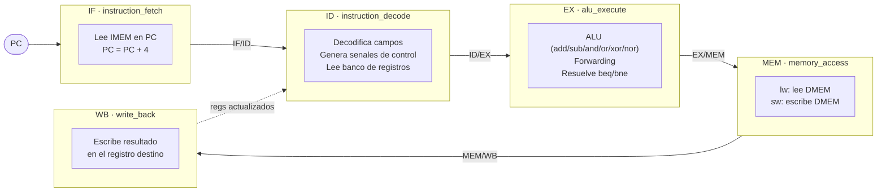
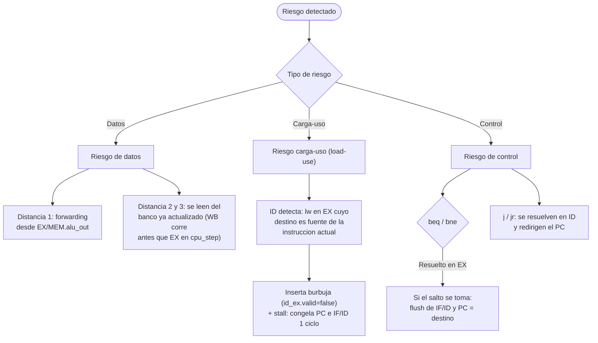

# Diagramas del simulador MIPS segmentado

Este documento contiene los diagramas del simulador. Los diagramas están en
[Mermaid](https://mermaid.js.org/), por lo que **GitHub los renderiza
automáticamente** al abrir este archivo. En la carpeta `docs/` también se
incluyen las versiones exportadas en SVG (`pipeline.svg`, `hazards.svg`).

---

## 1. Pipeline de 5 etapas con sus latches

Cada instrucción atraviesa las cinco etapas. Entre etapa y etapa hay un
**latch** (registro intermedio) que guarda el resultado parcial para el
siguiente ciclo de reloj: `IF/ID`, `ID/EX`, `EX/MEM`, `MEM/WB`.

Cada latch transporta exactamente los campos que la etapa siguiente necesita:

| Latch  | Contenido principal |
|--------|---------------------|
| IF/ID  | `instr`, `pc_plus_4`, `valid` |
| ID/EX  | `rs_val`, `rt_val`, `imm`, `rs/rt/rd`, `funct`, señales de control |
| EX/MEM | `alu_out`, `rt_val`, `dest_reg`, señales de control |
| MEM/WB | `mem_out`, `alu_out`, `dest_reg`, señales de control |

> **Nota de implementación:** en `cpu_step()` las etapas se llaman en orden
> inverso (WB → MEM → EX → ID → IF) para que cada etapa lea su latch de entrada
> *antes* de que la etapa anterior lo sobrescriba, emulando la actualización
> simultánea del hardware en un flanco de reloj.

---

## 2. Manejo de riesgos (hazards)

El simulador resuelve los tres tipos de riesgos del pipeline.

### Resumen de cada riesgo

- **Riesgos de datos (forwarding):** los operandos de la ALU se adelantan desde
  `EX/MEM` (instrucción 1 adelante) y desde el banco de registros ya actualizado
  (instrucciones 2 y 3 adelante, porque `write_back()` corre antes que la etapa
  EX dentro de `cpu_step()`).
- **Riesgo carga-uso (load-use):** cuando un `lw` es seguido inmediatamente por
  una instrucción que usa el registro cargado, se detecta en ID y se inserta una
  burbuja de 1 ciclo (se congela el PC e IF/ID).
- **Riesgos de control (flush):** los `beq`/`bne` se resuelven en EX; si el salto
  se toma, se descarta (flush) la instrucción en IF/ID y el PC se redirige al
  destino. Los saltos incondicionales `j`/`jr` se resuelven en ID.

---

## 3. Diagrama de tiempo del load-use stall

Ejemplo: `lw $t0, 0($s0)` seguido de `add $t2, $t0, $t1`. La `add` no puede
entrar a EX hasta que el dato del `lw` esté disponible tras MEM, así que se
inserta una burbuja.

```mermaid
gantt
    title Ciclos de reloj (una burbuja por load-use)
    dateFormat X
    axisFormat %s
    section lw $t0
    IF  :0, 1
    ID  :1, 1
    EX  :2, 1
    MEM :3, 1
    WB  :4, 1
    section add $t2 (depende de $t0)
    IF        :1, 1
    ID/espera :2, 1
    burbuja   :crit, 3, 1
    EX        :4, 1
    MEM       :5, 1
    WB        :6, 1
```

