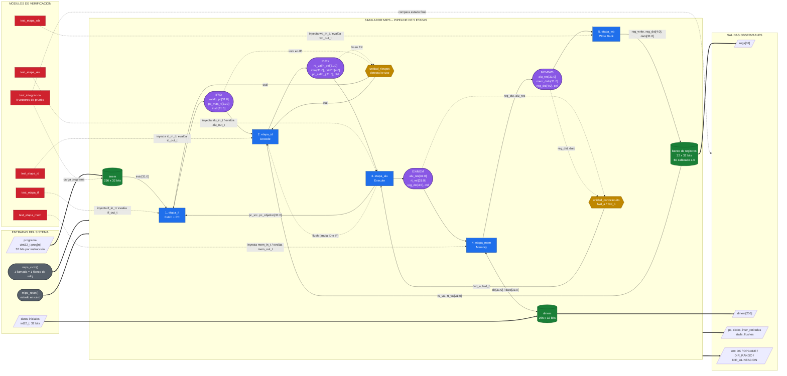
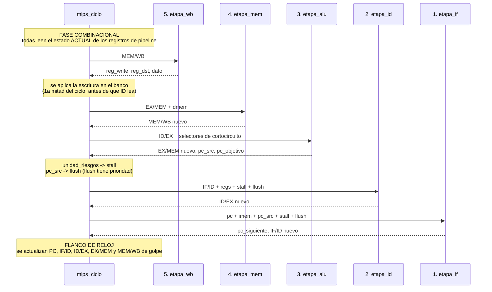

# Diagrama 1 — Sistema completo

El simulador entero: las cinco etapas, los registros que van entre ellas, las
memorias, las unidades que manejan los riesgos y los módulos de prueba que
atacan cada parte. Las flechas punteadas son señales de control; las gruesas,
datos que entran o salen del sistema.

## 1.1 Vista general

## 1.2 Entradas y salidas de cada módulo

| Módulo | Entradas | Salidas |
|---|---|---|
| `etapa_if` | `pc[31:0]`, `imem[]`, `imem_palabras`, `pc_src`, `pc_objetivo[31:0]`, `stall`, `flush` | `pc_siguiente[31:0]`, `IF/ID`, `cargar_if_id`, `err` |
| `etapa_id` | `IF/ID`, `regs[32][31:0]`, `stall`, `flush` | `ID/EX` (valores, índices `[4:0]`, `imm[31:0]`, `ctrl`), `err` |
| `etapa_alu` | `ID/EX`, `fwd_a`, `fwd_b`, `dato_ex_mem[31:0]`, `dato_mem_wb[31:0]` | `EX/MEM`, `pc_src`, `pc_objetivo[31:0]`, `cero` |
| `etapa_mem` | `EX/MEM`, `dmem[]`, `dmem_palabras` | `MEM/WB`, `err`, escritura en `dmem` |
| `etapa_wb` | `MEM/WB` | `reg_write`, `reg_dst[4:0]`, `dato[31:0]` |
| `unidad_riesgos` | `ID/EX`, `IF/ID` | `stall` |
| `unidad_cortocircuito` | `ID/EX`, `EX/MEM`, `MEM/WB` | `fwd_a`, `fwd_b` |

## 1.3 Cronograma de un ciclo (`mips_ciclo`)

