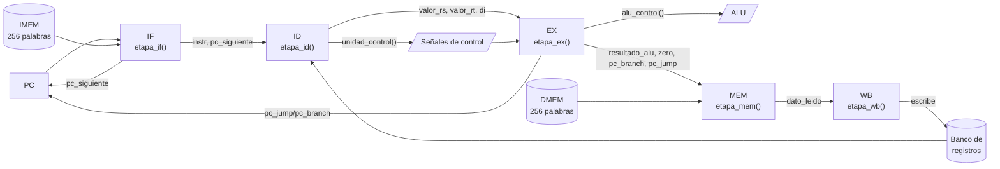

# Diagrama del sistema — datapath de 5 etapas

## Flujo por instrucción

Cada instrucción pasa secuencialmente por las 5 funciones (no hay
solapamiento de etapas — es un modelo funcional multi-ciclo, no un
pipeline con hazards):

1. **IF** lee `imem[pc/4]` y calcula `pc_siguiente = pc + 4`.
2. **ID** decodifica los campos de la instrucción y consulta la
   `unidad_control()` para obtener las señales (`reg_write`, `mem_read`,
   `alu_usa_inm`, etc.) y lee el banco de registros.
3. **EX** ejecuta la ALU (`alu_control()` decide la operación) y
   precalcula los posibles destinos de salto (`pc_branch`, `pc_jump`).
4. **MEM** accede a `dmem` solo si la instrucción es `lw`/`sw`.
5. **WB** escribe el resultado (ALU, memoria, o `pc+4` en el caso de
   `jal`) en el registro destino, respetando que `$zero` nunca cambia.

Al final de cada instrucción, `cpu_step()` decide el próximo PC según
si hubo salto (`es_jump`), branch tomado (`es_branch_eq`/`es_branch_ne`
+ `zero`), o ejecución secuencial normal.
