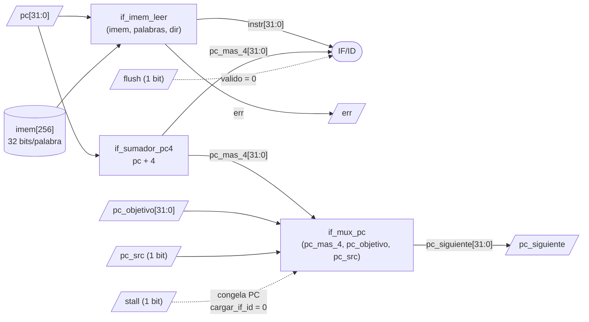
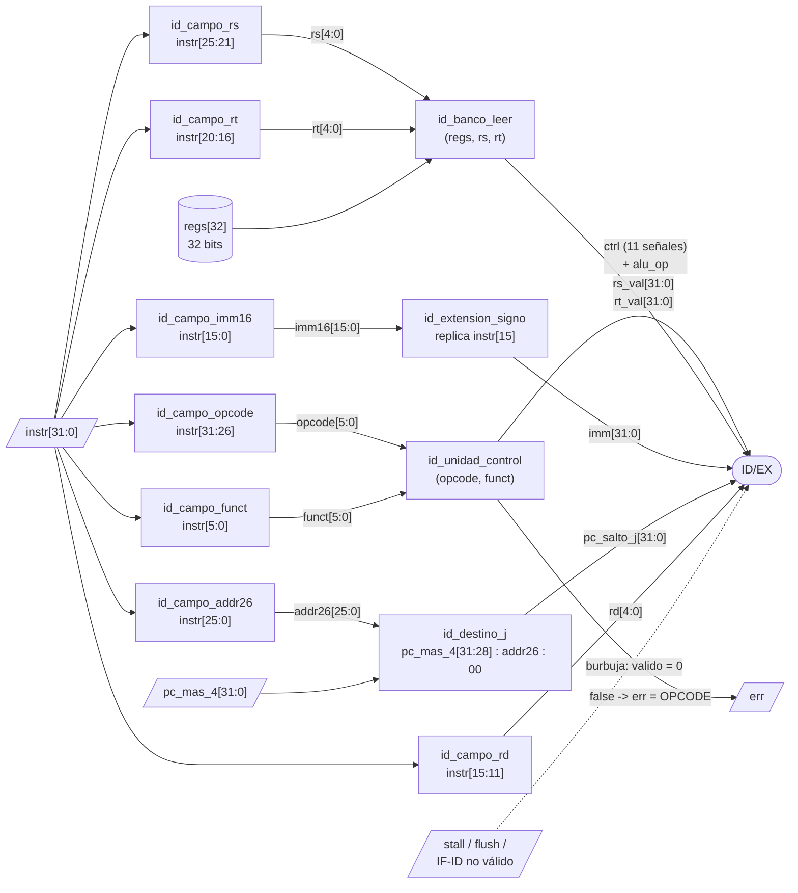
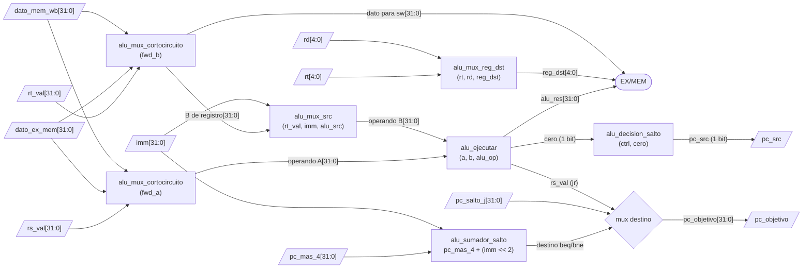
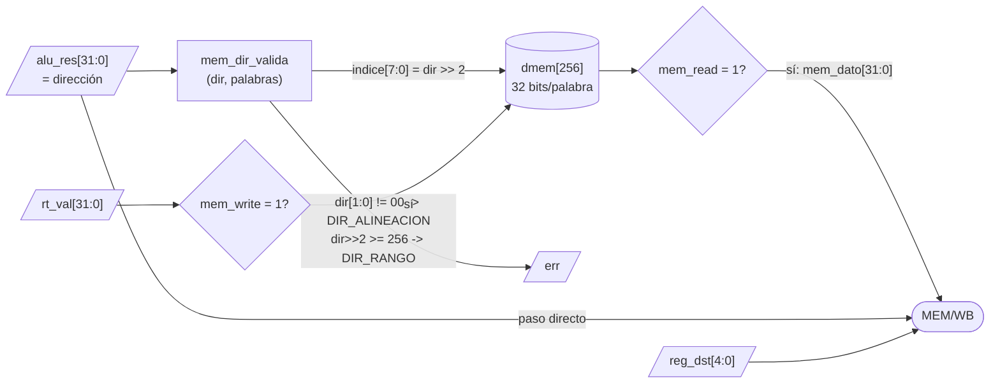
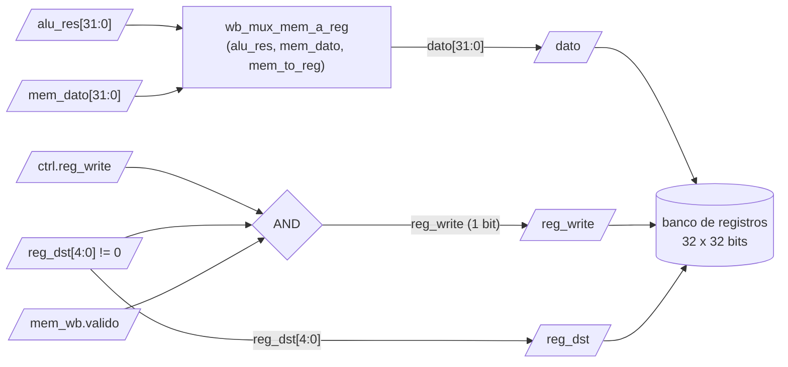
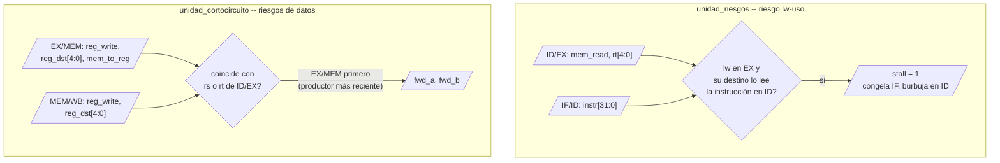

# Diagrama 2 — Subfunciones de cada etapa

Qué hay dentro de cada una de las cinco funciones: los muxes, sumadores y demás
bloques que la componen, con el número de bits e índice de cada señal que entra
y sale. Cada subfunción del diagrama existe como función en el código, así que
se pueden probar por separado.

---

## Etapa 1 — `etapa_if` (Instruction Fetch + Program Counter)

| Subfunción | Entradas | Salidas |
|---|---|---|
| `if_sumador_pc4` | `pc[31:0]` | `pc+4[31:0]` |
| `if_mux_pc` | `pc_mas_4[31:0]`, `pc_objetivo[31:0]`, `pc_src` | `pc_siguiente[31:0]` |
| `if_imem_leer` | `imem[]`, `palabras`, `dir[31:0]` | `instr[31:0]`, `err` |

Validaciones: `dir[1:0] != 00` → `DIR_ALINEACION`; `dir >> 2 >= palabras` → `DIR_RANGO`.
En ambos casos devuelve `NOP` para no propagar basura.

---

## Etapa 2 — `etapa_id` (Instruction Decode)

| Subfunción | Entradas | Salidas |
|---|---|---|
| `id_campo_*` | `instr[31:0]` | campo correspondiente |
| `id_extension_signo` | `imm16[15:0]` | `imm[31:0]` |
| `id_unidad_control` | `opcode[5:0]`, `funct[5:0]` | `ctrl`, `alu_op`, `bool` (soportada) |
| `id_banco_leer` | `regs[32]`, `rs[4:0]`, `rt[4:0]` | `rs_val[31:0]`, `rt_val[31:0]` |
| `id_destino_j` | `pc_mas_4[31:0]`, `addr26[25:0]` | `pc_salto_j[31:0]` |
| `id_registros_usados` | `instr[31:0]` | `usa_rs`, `usa_rt` (para la unidad de riesgos) |

### Tabla de la unidad de control

| Instr | opcode | funct | RegDst | ALUSrc | MemToReg | RegWrite | MemRead | MemWrite | Branch | Jump | ALUOp |
|---|---|---|---|---|---|---|---|---|---|---|---|
| `add` | 0x00 | 0x20 | 1 | 0 | 0 | 1 | 0 | 0 | – | – | ADD |
| `sub` | 0x00 | 0x22 | 1 | 0 | 0 | 1 | 0 | 0 | – | – | SUB |
| `and` | 0x00 | 0x24 | 1 | 0 | 0 | 1 | 0 | 0 | – | – | AND |
| `or`  | 0x00 | 0x25 | 1 | 0 | 0 | 1 | 0 | 0 | – | – | OR |
| `xor` | 0x00 | 0x26 | 1 | 0 | 0 | 1 | 0 | 0 | – | – | XOR |
| `nor` | 0x00 | 0x27 | 1 | 0 | 0 | 1 | 0 | 0 | – | – | NOR |
| `jr`  | 0x00 | 0x08 | – | – | – | 0 | 0 | 0 | – | jump_reg | PASA_A |
| `addi`| 0x08 | – | 0 | 1 | 0 | 1 | 0 | 0 | – | – | ADD |
| `lw`  | 0x23 | – | 0 | 1 | 1 | 1 | 1 | 0 | – | – | ADD |
| `sw`  | 0x2B | – | – | 1 | – | 0 | 0 | 1 | – | – | ADD |
| `beq` | 0x04 | – | – | 0 | – | 0 | 0 | 0 | eq | – | SUB |
| `bne` | 0x05 | – | – | 0 | – | 0 | 0 | 0 | ne | – | SUB |
| `j`   | 0x02 | – | – | – | – | 0 | 0 | 0 | – | jump | NOP |

---

## Etapa 3 — `etapa_alu` (Execute)

| Subfunción | Entradas | Salidas |
|---|---|---|
| `alu_mux_cortocircuito` | `valor_banco[31:0]`, `dato_ex_mem[31:0]`, `dato_mem_wb[31:0]`, `sel` | operando `[31:0]` |
| `alu_mux_src` | `rt_val[31:0]`, `imm[31:0]`, `alu_src` | operando B `[31:0]` |
| `alu_ejecutar` | `a[31:0]`, `b[31:0]`, `alu_op` | `resultado[31:0]`, `cero` |
| `alu_sumador_salto` | `pc_mas_4[31:0]`, `imm[31:0]` | `destino[31:0]` |
| `alu_mux_reg_dst` | `rt[4:0]`, `rd[4:0]`, `reg_dst` | `reg_dst[4:0]` |
| `alu_decision_salto` | `ctrl`, `cero` | `pc_src` |

Todos los saltos (`beq`, `bne`, `j`, `jr`) se resuelven aquí: una sola regla,
con penalidad fija de 2 instrucciones anuladas por salto tomado.

---

## Etapa 4 — `etapa_mem` (Memory)

| Subfunción | Entradas | Salidas |
|---|---|---|
| `mem_dir_valida` | `dir[31:0]`, `palabras` | `indice`, `err`, `bool` |

Una dirección inválida **aborta el acceso**: no se escribe ni se lee nada.

---

## Etapa 5 — `etapa_wb` (Write Back)

| Subfunción | Entradas | Salidas |
|---|---|---|
| `wb_mux_mem_a_reg` | `alu_res[31:0]`, `mem_dato[31:0]`, `mem_to_reg` | `dato[31:0]` |

La etapa **no escribe** directamente: devuelve la orden y el núcleo la aplica.
Así la función es pura (fácil de probar) y el mismo dato alimenta el
cortocircuito MEM/WB hacia la etapa 3.

---

## Unidades de manejo de riesgos

| Riesgo | Distancia | Solución |
|---|---|---|
| Datos (ALU → ALU) | 1 | cortocircuito EX/MEM |
| Datos (ALU → ALU) | 2 | cortocircuito MEM/WB |
| Datos (ALU → ALU) | 3 | banco que escribe en la 1ª mitad del ciclo |
| Datos `lw` → uso | 1 | burbuja de 1 ciclo (`unidad_riesgos`) + cortocircuito MEM/WB |
| Control (`beq`, `bne`, `j`, `jr`) | — | anulación de las 2 instrucciones más jóvenes |
