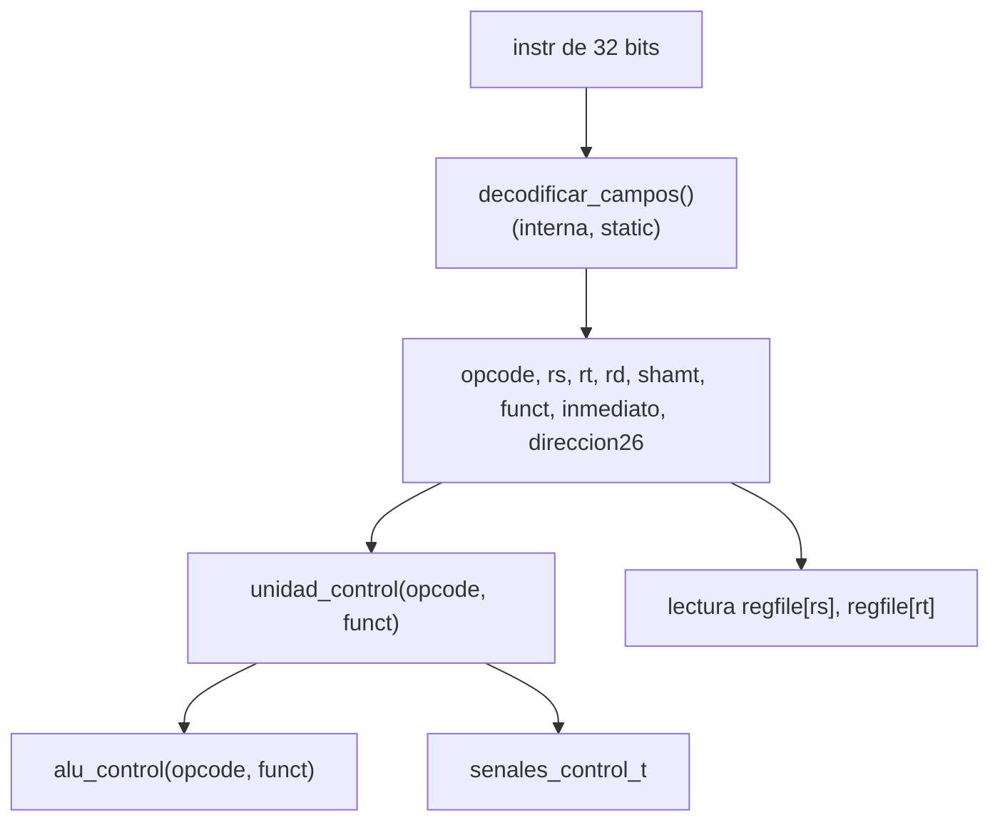
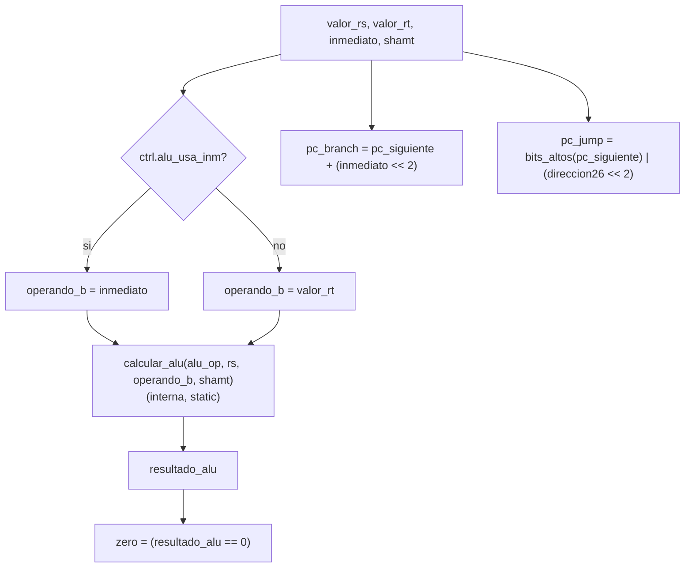

# Diagrama de subfunciones por etapa

## ID — decodificación y control

## EX — ALU y cálculo de destinos de salto

## Unidades de control (tabla de verdad resumida)

| opcode  | reg_write | mem_read | mem_write | mem_to_reg | alu_usa_inm | branch | jump | link |
|---------|:---------:|:--------:|:---------:|:----------:|:-----------:|:------:|:----:|:----:|
| R-type  | 1         | 0        | 0         | 0          | 0           | 0      | 0    | 0    |
| addi    | 1         | 0        | 0         | 0          | 1           | 0      | 0    | 0    |
| lw      | 1         | 1        | 0         | 1          | 1           | 0      | 0    | 0    |
| sw      | 0         | 0        | 1         | -          | 1           | 0      | 0    | 0    |
| beq     | 0         | 0        | 0         | -          | 0           | eq     | 0    | 0    |
| bne     | 0         | 0        | 0         | -          | 0           | ne     | 0    | 0    |
| j       | 0         | 0        | 0         | -          | -           | 0      | 1    | 0    |
| jal     | 1         | 0        | 0         | 0          | -           | 0      | 1    | 1    |

## ALU control (`alu_control`)

| opcode/funct        | operación ALU |
|----------------------|----------------|
| addi, lw, sw          | ADD            |
| beq, bne               | SUB (para comparar) |
| R-type + funct=ADD     | ADD            |
| R-type + funct=SUB     | SUB            |
| R-type + funct=AND     | AND            |
| R-type + funct=OR      | OR             |
| R-type + funct=SLT     | SLT            |
| R-type + funct=SLL     | SLL            |
